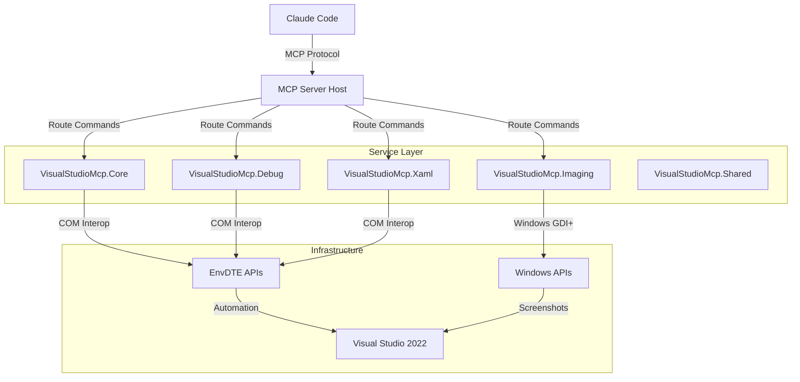
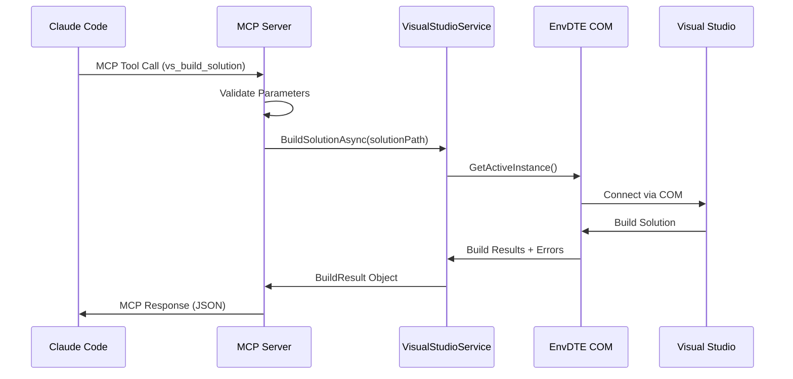
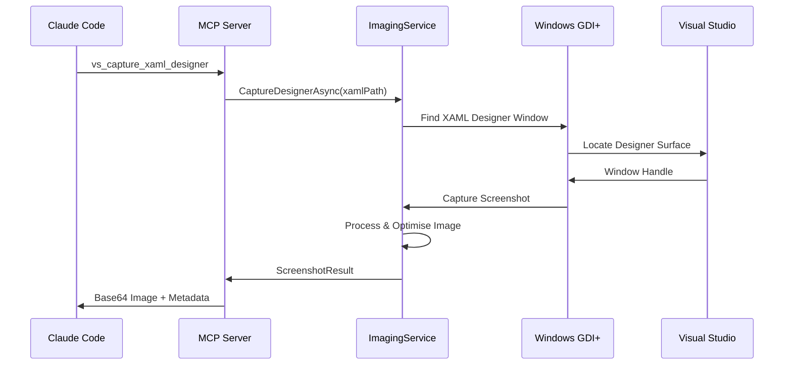

# System Architecture

This document describes the high-level architecture of the Visual Studio MCP Server, including its components, interactions, and design principles.

## Overview

The Visual Studio MCP Server is a .NET 8 console application that bridges Claude Code with Visual Studio through COM interop, providing comprehensive automation capabilities for development workflows.

## Architectural Principles

### 1. Separation of Concerns
Each service has a single responsibility:
- **Core Service** - Visual Studio instance management
- **Debug Service** - Debugging session control  
- **XAML Service** - Designer automation
- **Imaging Service** - Screenshot capture

### 2. Dependency Injection  
All services use Microsoft.Extensions.DependencyInjection for:
- Testability through interface abstractions
- Lifecycle management of COM objects
- Configuration management

### 3. COM Interop Safety
Strict patterns for COM object management:
- Proper disposal with `Marshal.ReleaseComObject()`
- Exception handling for COM failures
- Thread-safe operations with EnvDTE

## High-Level Architecture



## Component Architecture

### MCP Server Host
**Location:** `src/VisualStudioMcp.Server/`

**Responsibilities:**
- MCP protocol implementation and message routing
- Service registration and dependency injection setup
- Structured logging and error handling
- Application lifecycle management

**Key Classes:**
```csharp
public class VisualStudioMcpServer : IDisposable
{
    // MCP tool routing and execution
    public Task<McpToolResult> ExecuteToolAsync(string toolName, JsonNode parameters);
}

public class Program  
{
    // Application entry point and service configuration
    public static async Task Main(string[] args);
}
```

### Core Visual Studio Service
**Location:** `src/VisualStudioMcp.Core/`

**Responsibilities:**
- Visual Studio instance discovery and connection
- Solution and project management
- Build automation and error capture
- General IDE automation

**Key Interfaces:**
```csharp
public interface IVisualStudioService
{
    Task<IEnumerable<VsInstance>> ListInstancesAsync();
    Task<ConnectionResult> ConnectToInstanceAsync(string instanceId);
    Task<BuildResult> BuildSolutionAsync(string solutionPath);
    Task<ProjectInfo> GetProjectInfoAsync(string projectPath);
}
```

### Debug Automation Service
**Location:** `src/VisualStudioMcp.Debug/`

**Responsibilities:**
- Debugging session lifecycle management
- Breakpoint management and control
- Runtime state inspection
- Debug output capture

**Key Interfaces:**
```csharp
public interface IDebugService
{
    Task<DebugSession> StartDebuggingAsync(string projectPath);
    Task<DebugState> GetDebugStateAsync();
    Task<bool> SetBreakpointAsync(string file, int line);
    Task StopDebuggingAsync();
}
```

### XAML Designer Service
**Location:** `src/VisualStudioMcp.Xaml/`

**Responsibilities:**
- XAML designer surface interaction
- Designer view capture and analysis
- XAML element inspection
- Design-time data binding support

**Key Interfaces:**
```csharp
public interface IXamlDesignerService  
{
    Task<XamlDesignerInfo> GetDesignerInfoAsync(string xamlFilePath);
    Task<ScreenshotResult> CaptureDesignerAsync(string xamlFilePath);
    Task<ElementInfo[]> GetDesignElementsAsync(string xamlFilePath);
}
```

### Imaging Service
**Location:** `src/VisualStudioMcp.Imaging/`

**Responsibilities:**
- Window and screen capture functionality
- Image processing and optimisation
- Visual context capture for Claude Code
- Screenshot metadata generation

**Key Interfaces:**
```csharp
public interface IImagingService
{
    Task<ScreenshotResult> CaptureWindowAsync(IntPtr windowHandle);
    Task<ScreenshotResult> CaptureVisualStudioAsync();
    Task<ScreenshotResult> CaptureRegionAsync(Rectangle region);
    Task<byte[]> OptimiseImageAsync(byte[] imageData);
}
```

### Shared Components
**Location:** `src/VisualStudioMcp.Shared/`

**Responsibilities:**
- Common data models and DTOs
- Shared interfaces and contracts
- Extension methods and utilities
- Error handling types

**Key Components:**
```csharp
// Core models
public record VsInstance(string Id, string Version, string SolutionPath);
public record BuildResult(bool Success, IList<BuildError> Errors);
public record ScreenshotResult(byte[] ImageData, ImageMetadata Metadata);

// Error handling
public class McpToolResult
{
    public bool Success { get; init; }
    public object? Data { get; init; }
    public string? ErrorMessage { get; init; }
}
```

## Data Flow Architecture

### 1. MCP Command Processing



### 2. Screenshot Capture Flow



## Threading and Concurrency

### COM Threading Model
```csharp
// All COM operations must run on background threads
public async Task<BuildResult> BuildSolutionAsync(string solutionPath)
{
    return await Task.Run(() =>
    {
        DTE dte = null;
        try
        {
            dte = GetActiveVisualStudioInstance();
            // COM operations here - EnvDTE is not thread-safe
            return BuildSolution(dte, solutionPath);
        }
        finally
        {
            if (dte != null)
                Marshal.ReleaseComObject(dte);
        }
    });
}
```

### Async Patterns
- All public service methods are async
- COM interop operations wrapped in `Task.Run()`
- Cancellation token support throughout
- Proper resource disposal with `using` and `finally` blocks

## Error Handling Strategy

### Exception Hierarchy
```csharp
public class VisualStudioException : Exception
public class ComInteropException : VisualStudioException  
public class VisualStudioNotFound : VisualStudioException
public class BuildFailedException : VisualStudioException
public class DebugSessionException : VisualStudioException
```

### Error Response Pattern
```csharp
public class McpToolResult
{
    public bool Success { get; init; }
    public object? Data { get; init; }
    public string? ErrorMessage { get; init; }
    public string? ErrorCode { get; init; }
    public Dictionary<string, object>? ErrorContext { get; init; }
}
```

## Security Model

### COM Security
- **CLSCTX_LOCAL_SERVER** - Secure COM activation context
- **Process Isolation** - Visual Studio runs in separate process
- **Permission Validation** - Input validation before COM calls

### Data Security  
- **No Persistent Storage** - Screenshots stored temporarily only
- **Memory Management** - Proper disposal of sensitive data
- **Local Operation** - No network exposure or remote access

## Performance Considerations

### Memory Management
```csharp
// Pattern for COM object lifecycle management
DTE dte = null;
try
{
    dte = GetActiveVisualStudioInstance();
    // Use dte here
    return result;
}
finally
{
    if (dte != null)
    {
        Marshal.ReleaseComObject(dte);
        GC.Collect(); // Force cleanup for COM objects
    }
}
```

### Screenshot Optimization
- **Image Compression** - PNG with optimal compression settings
- **Resolution Scaling** - Automatic scaling for large captures
- **Memory Streaming** - Stream processing for large images
- **Temporary File Cleanup** - Automatic cleanup of screenshot files

## Deployment Architecture

### Global Tool Packaging
```xml
<PropertyGroup>
    <PackAsTool>true</PackAsTool>
    <ToolCommandName>vsmcp</ToolCommandName>
    <PackageOutputPath>./nupkg</PackageOutputPath>
</PropertyGroup>
```

### Runtime Dependencies
- **.NET 8 Runtime** - Self-contained deployment option
- **Visual Studio COM APIs** - EnvDTE redistributables
- **Windows APIs** - GDI+ for screenshot capture

## Monitoring and Observability

### Structured Logging
```csharp
// Logging pattern with correlation IDs
_logger.LogInformation(
    "Building solution {SolutionPath} for instance {InstanceId}",
    solutionPath, instanceId);
```

### Performance Metrics
- MCP tool execution times
- COM operation latency
- Screenshot capture performance  
- Memory usage tracking

### Health Checks
```csharp
public class VisualStudioHealthCheck : IHealthCheck
{
    public Task<HealthCheckResult> CheckHealthAsync(
        HealthCheckContext context, 
        CancellationToken cancellationToken = default);
}
```

## Extension Points

### Custom MCP Tools
```csharp
[McpTool("vs_custom_operation")]
public async Task<McpToolResult> CustomOperationAsync(
    [McpParameter("parameter")] string parameter)
{
    // Custom tool implementation
}
```

### Service Extensibility
- Interface-based design allows for custom implementations
- Dependency injection enables service replacement
- Plugin architecture possible for future extensions

## Future Architecture Considerations

### Multi-Instance Support
- Connection pooling for multiple VS instances
- Instance-specific operation routing
- Resource management across instances

### Advanced Screenshot Features
- Video capture for debugging workflows
- Interactive element highlighting
- OCR for text recognition in screenshots

### Cross-Platform Considerations
- Visual Studio Code integration possibilities
- .NET MAUI tooling support
- Remote development scenario support

---

**Next:** Review [COM Interop Patterns](com-interop-patterns.md) for implementation details.